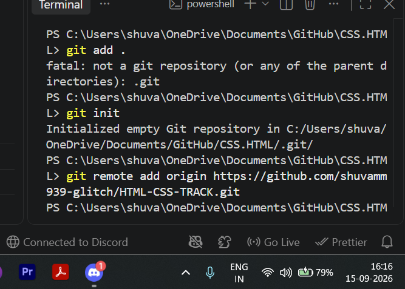

TRACK

   ```
   Creat new file
   ```
   ```
   then open it on "vs code"
   ```
   ```
   then open terminal
   ```
   git init(command used in terminal)
   for commiunication vs code or git hub
   ```
git remote add origin https://github.com/shuvamm939-glitch/HTML-CSS-TRACK.git
git remote add origin https://github.com/shuvamm939-glitch/HTML-CSS-TRACK.git

   ```
 
